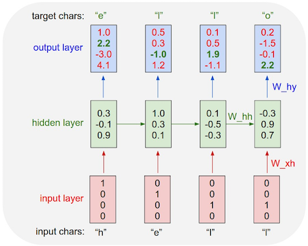
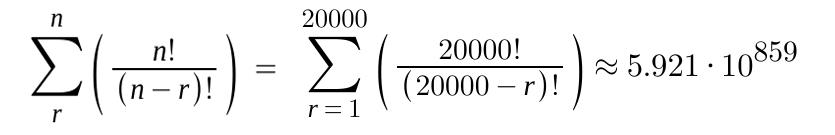
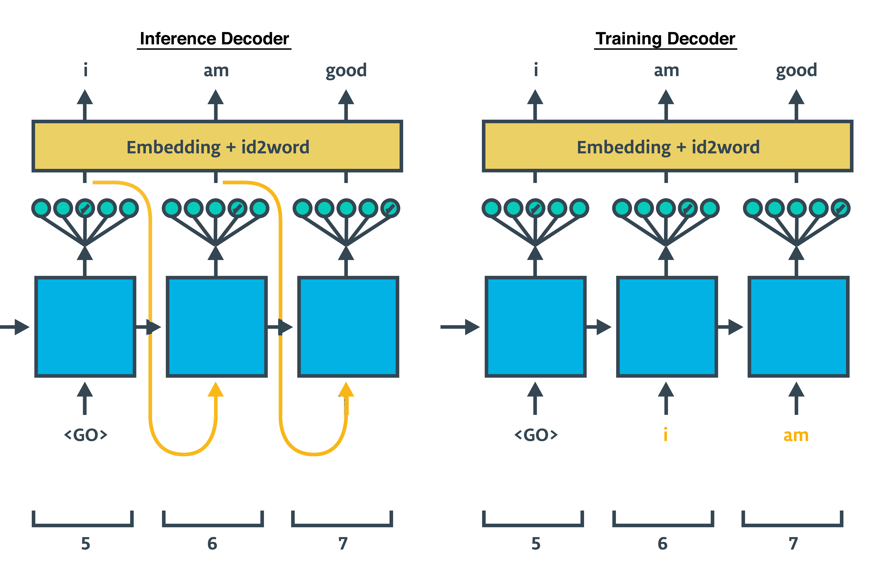

## Project 4 - Language Translation

This project demonstrates the use of a sequence-to-sequence model applied to an English to French translation problem.

#### Motivation 
Consider that the approximate vocabulary size of an adult English speaker is ~ 20,000 words. If we want to translate any (meaningful) permutation of these with an RNN, we would need output neurons for every one of these permutations of words.

This is fine if we are only predicting a single output word or single output character that may come next in the sequence and we can limit our output nodes to a vocab or alphabet size, but if we desire a variable length output sequence from a variable length input sequence, the method falls short. The number of output nodes required for this would be as follows…

This number includes many nonsensical permutations of words, however even a fraction of this would be far too many nodes to train in a reasonable amount of time. So how can a sequence-to-sequence network solve this problem?

#### Sequence-to-sequence Networks
The primary benefit of a sequence to sequence network is that it allows us to generate accurate variable length output sequences given variable length input sequences.  A sequence-to-sequence network is made up of two RNNs. One of the RNNs is used to process the input to the network (encoder), and the second generates the output of the network (decoder).

Both the encoder and decoder consist of a stack of LSTM cells. Just as a regular RNN, the encoder is fed input vectors and then modifies its weights/state in addition to producing output for each time step. The output of the encoder is discarded but the state is passed on as an input to the decoder. This provides the encoder with context about what input has been fed to the encoder leading up to the current time step. The decoder is trained in tandem with the encoder, utilizing both the encoder state and its own input to generate output. 

e.g.: **Chat Bot Example: User input sequence to system response sequence**
* Decoder sees that encoder context is t0: “How”, t1: “are”, t2: “you”,
* Decoder then selects from its output corpus the next most likely word: “I” using both its own weights as well as the encoder context to inform the choice. 
* It then generates the remaining response elements “am”, and “fine” during the next time steps.

Once the model is fully trained and we want to use it with real world data we hand off the decoder state to the inference decoder. It is the same as the original training decoder except that instead of utilizing the labels provided from the training data as inputs to each time step, we now must use the inference decoder’s output from the previous time step.

To view the implementation of this project, check out the Project4.ipynb file which should load a viewable version within your browser. If you wish to run the notebook yourself I have provided the remaining required files to do so in the X directory. If you want to learn more about the topics covered in this project, see links below. 

[First paper introducing sequence-to-sequence models](https://arxiv.org/abs/1406.1078)
[RNN & LSTM](https://deeplearning4j.org/lstm.html)
[Great Seq2Seq Lecture - Quoc Le, Google](https://www.youtube.com/watch?v=G5RY_SUJih4)
[Tensorflow Tutorial on Seq2Seq](https://www.tensorflow.org/tutorials/seq2seq)
